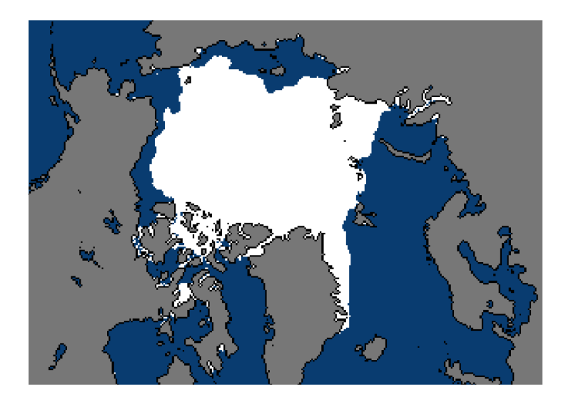
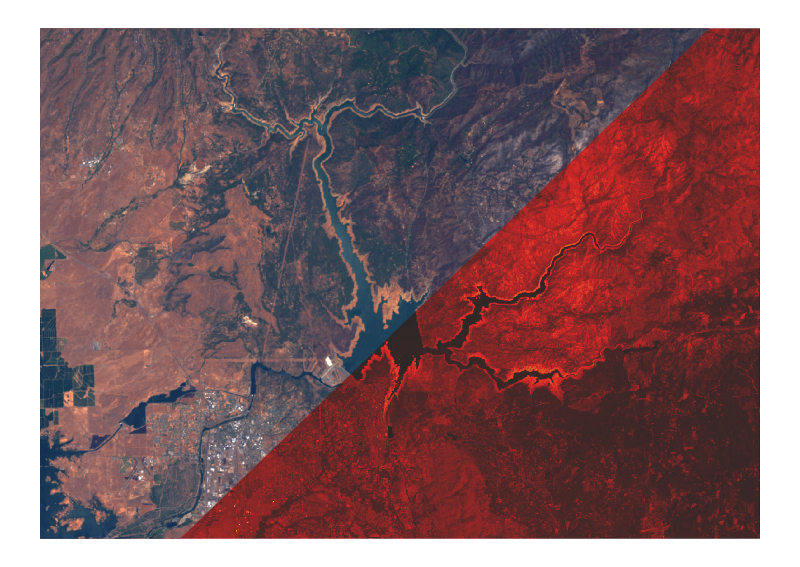
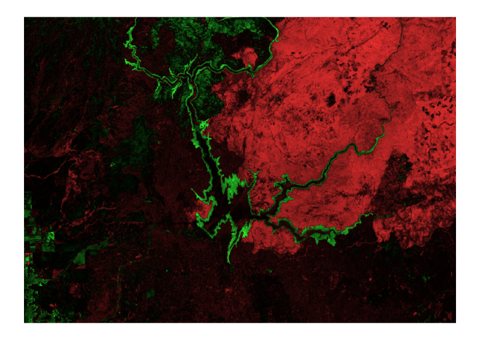

# Multispectral Image Processing

## Background

Use these live scripts as demonstrations in lectures, class activities, or interactive assignments outside class. This module covers importing, visualizing, and analyzing data. It also includes examples of analyzing temperature anomaly data and Arctic sea ice data, as well as using multispectral imaging data to characterize drought in Northern California.

The instructions inside the live scripts will guide you through the exercises and activities. Get started with each live script by running it one section at a time. To stop running the script or a section midway (for example, when an animation is in progress), use the  Stop button in the **RUN** section of the **Live Editor** tab in the MATLAB Toolstrip.

## Prerequisites

This module assumes you have a basic understanding of MATLAB. If you do not, consider completing [<u>MATLAB Onramp</u>](https://matlabacademy.mathworks.com/details/matlab-onramp/gettingstarted) before starting this module.

Ensure you have all the required products (listed below) installed. If you need to include a product, add it using the Add\-On Explorer. To install an add\-on, go to the **Home** tab and select   **Add-Ons** > **Get Add-Ons**. 

# Scripts
## [**ArcticSeaIce.mlx**](https://matlab.mathworks.com/open/github/v1?repo=MathWorks-Teaching-Resources/Climate-Data-Visualization-and-Analysis&project=ClimateVis.prj&file=Scripts/ArcticSeaIce.mlx)
|      |      |
| :-- | :-- |
|     | **In this script, students will...**   $\bullet$ Load and display Arctic sea ice extent GeoTIFF data   $\bullet$ Quantify Arctic sea ice extent using logical operators   $\bullet$ Use a for loop to analyze changes to Arctic sea ice from 1979 to 2021   $\bullet$ Compute the linear trend of Arctic sea ice extent     |
|      |       |

## [**MultispectralImaging.mlx**](https://matlab.mathworks.com/open/github/v1?repo=MathWorks-Teaching-Resources/Climate-Data-Visualization-and-Analysis&project=ClimateVis.prj&file=Scripts/MultispectralImaging.mlx)
|      |      |
| :-- | :-- |
|     | **In this script, students will...**   $\bullet$ List the spectral band designations for the Landsat 8 satellite   $\bullet$ Load and display single band images   $\bullet$ Use metadata to rescale a spectral band   $\bullet$ Create an RGB image from spectral bands     |
|      |       |

## [**MultispectralIndices.mlx**](https://matlab.mathworks.com/open/github/v1?repo=MathWorks-Teaching-Resources/Climate-Data-Visualization-and-Analysis&project=ClimateVis.prj&file=Scripts/MultispectralIndices.mlx)
|      |      |
| :-- | :-- |
|     | **In this script, students will...**   $\bullet$ Compute multispectral indices (NDVI and NDWI) from Landsat 8 data   $\bullet$ Analyze the reduction of reservoir area due to drought   $\bullet$ Superimpose a multispectral index on an RGB image   $\bullet$ Quantify changes to vegetation   $\bullet$ Apply image processing techniques, such as creating a binary mask and registering images     |
|      |       |

# License

The license for this module is available in the [LICENSE.md](https://github.com/MathWorks-Teaching-Resources/Climate-Data-Visualization-and-Analysis/blob/release/LICENSE.md).

 *©* Copyright 2026 The MathWorks, Inc

